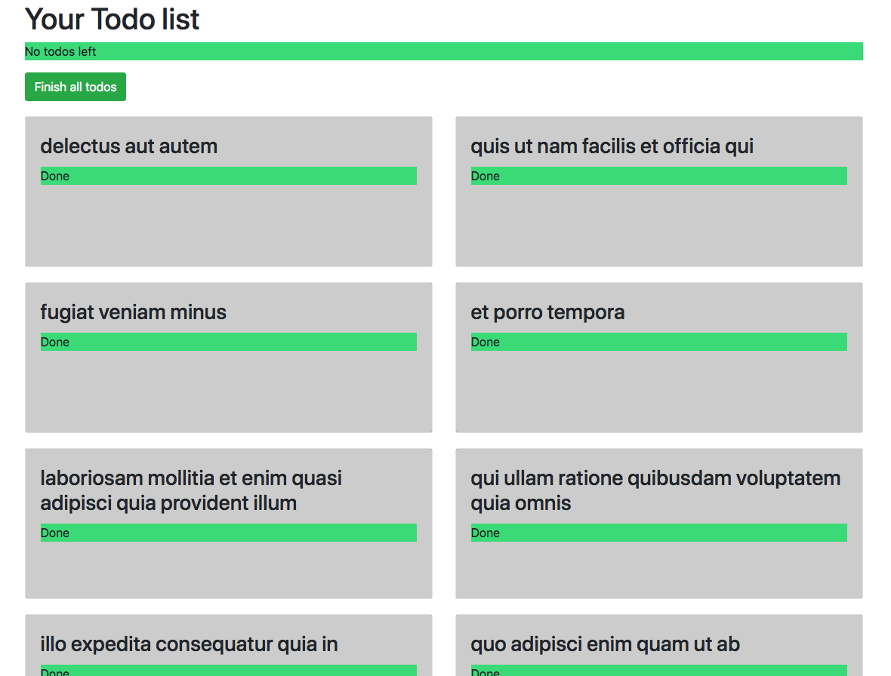

# App

This project was generated with [Angular CLI](https://github.com/angular/angular-cli) version 8.3.25.

## Development server

Run `ng serve` for a dev server. Navigate to `http://localhost:4200/`. The app will automatically reload if you change any of the source files.

# Task

You are given the task of updating an application with the following requirements.

1. You are to make a backend call to get a list of todos.
  - You make a `get` request to the url 'https://jsonplaceholder.typicode.com/todos'

1. When a `todo` is `completed`, the background color of the todo status becomes green and the status reads "Done". If a todo is not done, the background color does not change and the text reads "Not done"

1. At the top of the page, we have a message that shows how many todos are left. When there are no todos left, the message also has a background color of green. If there are todos left, the message at the top says "You have X todos left." If all the todos are complete, it shows "No todos left".

1. There is a button at the top of the page. When it is clicked, all of the todos in the list are marked as `completed` and the page updates accordingly.

1. For desktop views, the page needs two columns. For mobile, the page has one column.

1. Methods must be adequately unit tested.

Below are the designs you are given:

